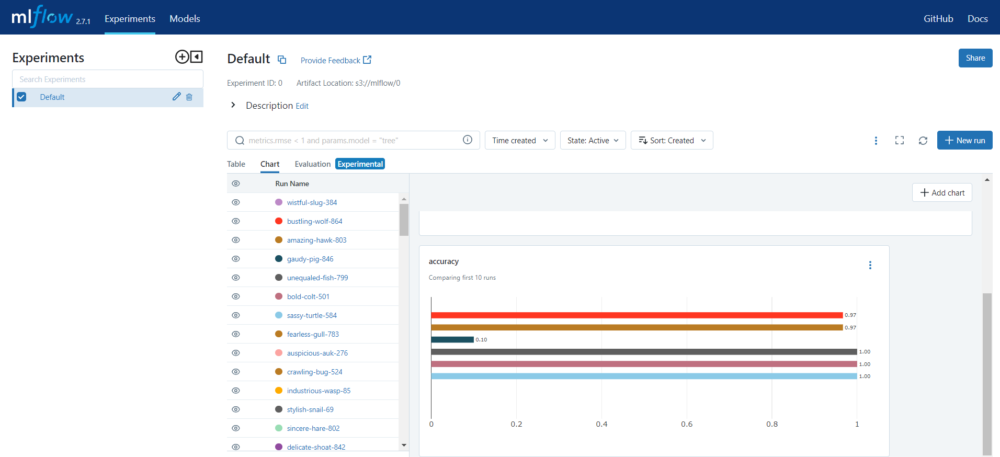
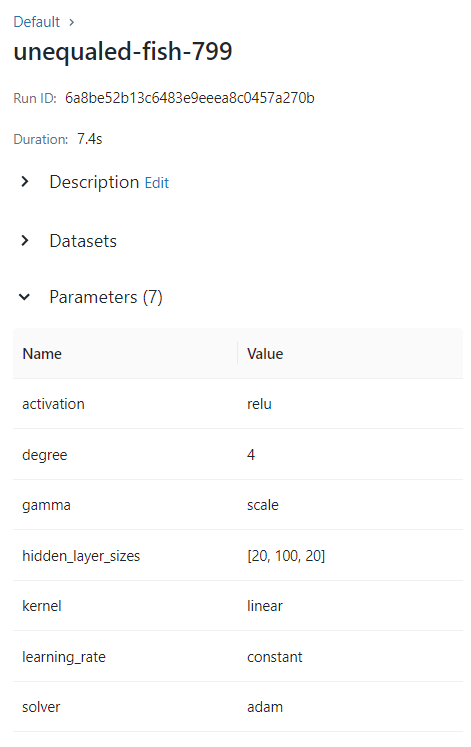
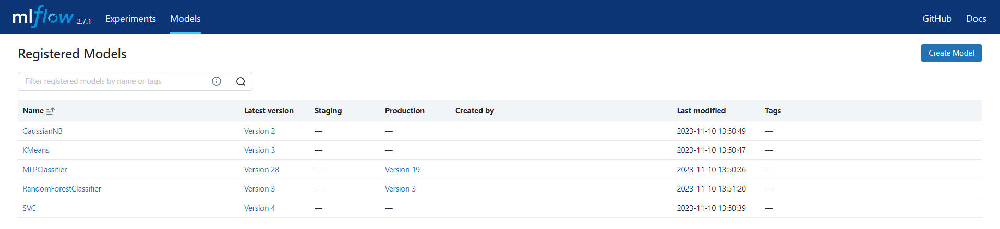

# Отчет по лабораторной работе №3

## Задание на лабораторную работу:
Целю лабораторной работы является знакомство с сервисом жизненного цикла моделей машинного обучения - MLflow, в рамках работы необходимо построить два pipeline - первый обучает модель по заданным в конфигурации параметрам и логирует метрики, параметры, а также саму модель, второй производит валидацию и по ее результатам переводит лучшую модель на этап Production.

## Ход выполнения лабораторной работы

### Пайплайн обучения модели

Для реализации первого pipeline используем следующие операторы:
1. FileSensor - для определения наличия файла конфигурации в указанной директории.
2. BashOperator - для выполнения Python файла.

BashOperator предназначен для выполнения комманд под  Bash shell, его код выглядит следующим образом:
`train_model = BashOperator(
    task_id="train_model",
    bash_command="python /opt/airflow/data/lab3/train_model.py",
    dag=dag
)`
Основным параметром данного оператора является **bash_command* - выполняемая команда.

Выполняемый файл train_model.py содержит логику импорта модели по файлу конфигурации, который выглядит следующим образом:
`{
    "configs": [
        {
        "module": "sklearn.neural_network",
        "classificator": "MLPClassifier",
        "kwargs": {
            "hidden_layer_sizes": [20, 100, 20],
            "activation": "relu",
            "solver": "adam",
            "learning_rate": "constant"
            }
        }]
},`
Файл с полным составом конфигурации моделей можно найти в директории проекта - conf.json.

Отметим несколько особенностей реализации кода:
1. Привязка к серверу MlFlow осуществялеться при помощи - "mlflow.set_tracking_uri", в качестве парамета которого передается uri - "http://mlflow_server:5000".
2. Для логирования параметров воспользуемся методом - "mlflow.log_params", в качестве параметов передаем считанные из конфигурации значения.
3. Логирование метрик можно сделать при помощи - "mlflow.log_metrics", в качетсве параметров передаем объект содержащий рассчитанные характеристики.
4. Для сохранения модели используем - "mlflow.sklearn.log_model", в качестве параметров передаются **sk_model* - сама модель, **artifact_path* - путь к модели в эксперименте, будет соответствовать названию модуля sklearn, **registered_model_name* - название созраняемой модели, в нашем случае соответствует классификатору.
5. Промежуточные данные с uri созданных моделей для удобства будем сохранять в файл - "models.csv".
Файл с полным кодом можно найти в директории проекта - train_model.py.
После выполнения получим следущий результат:

Файл с полным кодом DAG можно найти в указанной директории - airflow-skclass-fit-node.py.

### Пайплайн валидации модели

Второй pipeline содержит только один BashOperator, который в свою очередь выполняет функции загрузки моделей, валидации и установки статуса лучшей модели в Production.
Его особенностью является срабатываение по таймеру - которое реализовано при помощи добавления параметра "schedule_interval='@hourly'".
`dag = DAG(
    'sklearn_classificator_host',
    default_args=default_args,
    description='DAG for validate and host sk-learn model',
    schedule_interval='@hourly',
)`

Отметим несколько особенностей реализации кода:
1. Для поиска версии модели воспользуемся методом "search_model_versions" в который передается строка с фильтром по названию и uri модели.
2. Для установки статуса модели "Production" будем использовать метод "transition_model_version_stage", принимающий в качестве параметов название и версию модели.
Файл с полным кодом можно найти в директории проекта - validate_model.py.

В результате запустка получим:

Файл с полным кодом DAG можно найти в указанной директории - airflow-skclass-host-node.py.