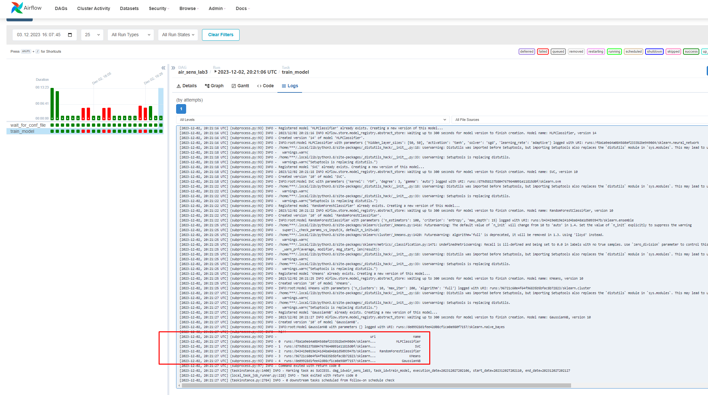
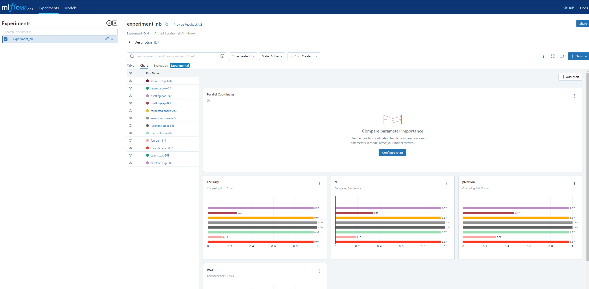
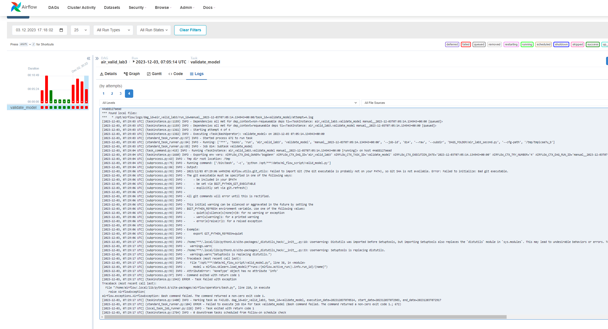

# Лабораторная работа №3
### Выполнил студент 6231-010402D Непряхин Богдан Олегович

Перед тем как начать выполнять работу необходимо установить  docker-compose.mlflow.yaml из **Prerequisites** предварительно указав порт 3307 тк по какой то причине у меня не запускаля этот compose на 3306 порту далее работа вся будет вестись уже с теми настройками airflow которые мы делали в 1 и 2ой лаб работах.

## Задание 1: Пайплайн для обучения классификаторов
1. Производим мониторинг целевой папки на предмет появления новых конфигурационных файлов классификаторов (в форматах .json или .yaml)
- Для решения этой задачи будем использовать функцию DAG FileSensor() файл JSON с параметрами модели [расположен в data](./ml_flow_in/config.json)
  
```python
wait_for_conf_file = FileSensor(
    task_id='wait_for_conf_file',
    poke_interval=10,
    filepath='/opt/airflow/data/ml_flow_in/config.json',
    fs_conn_id='airflow_cn',
    dag=dag,
)
```

2. После того как файл найден обучаем модель и логгируем даныне в mlflow и сохраняем csv файл с названиями моделей и их версияи для того чтобы к ним потом обратиться на этапе валидации
   ```python
    train_model = BashOperator(
        task_id="train_model",
        bash_command="python /opt/airflow/data/ml_flow_script/ml_model.py",
        dag=dag
    )
    ```

Ход выполнения работы DAG 
 

по итогу которого данные пишутся в mlflow  
Тк в процессе "изучения" инструмента мною был удален deaful ID эксперимент, пришлось разобраться как создавать новые и к ним обращаться..интересный опыт которого можно было избежать =)

```python
    # Установка названия эксперимента
    experiment_name = 'experiment_nb'
    mlflow.set_experiment(experiment_name)
```
Код DAG, который выполняет все выше описанные [преобразования:](./dags/air_lab3.py)
[Код py который обучает модель](./ml_flow_script/ml_model.py)

## Задание 2: Во втором задании мы должны провести валидацию обученных моделей выбрать лучшую и захостить её на mlflow в Прод
В рамках выполняемой задачи был написан код для [валидации](./ml_flow_script/valid_model.py) однако по итогу его работы возвращается ошибка корень которой до конца не ясен, требуется дополнительное время для разбора этого процесса.
* Проблема в том что при запросе всех выполняемых моделей на сервере mlflow мне возвращается ответ 0 как будто ни одной модели на сервере не запущено
Варианты с mlflow.active_run() и mlflow.search_runs() так же ничего не возвращают в ответ кроме пустоты
Ход выполнения работы DAG 
 
